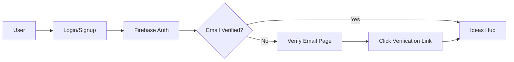

# TradeIdea - Architecture & Deployment Documentation

## 🏗️ System Architecture

### Frontend Architecture
- **Framework**: Next.js 15.5.4 with App Router
- **Language**: TypeScript
- **Styling**: Tailwind CSS v4 with custom dark mode
- **Build Tool**: Turbopack (Next.js bundler)
- **Deployment**: Vercel (Serverless)

### Backend & Database
- **Authentication**: Firebase Authentication
- **Database**: Firestore (NoSQL)
- **Storage**: Firebase Storage (for future file uploads)
- **Hosting**: Vercel Edge Network

### State Management
- **Context API**: React Context for global state
  - `AuthContext`: User authentication & profile
  - `TradingContext`: Trading ideas & portfolio
  - `SymbolsContext`: Stock symbols data
  - `ThemeContext`: Dark/light mode

## 📁 Project Structure

```
myportfolio-web/
├── app/                          # Next.js App Router pages
│   ├── ideas/                    # Trading ideas hub
│   │   ├── [id]/page.tsx        # Idea detail page
│   │   ├── new/page.tsx         # Create new idea
│   │   └── page.tsx             # Ideas list
│   ├── portfolio/page.tsx       # User portfolio
│   ├── profile/page.tsx         # User profile
│   ├── login/page.tsx           # Auth page
│   ├── layout.tsx               # Root layout
│   └── page.tsx                 # Landing page
├── components/                   # Reusable components
│   ├── Navigation.tsx           # Main navigation
│   └── icons.tsx                # SVG icon components
├── contexts/                     # React Context providers
│   ├── AuthContext.tsx          # Authentication
│   ├── TradingContext.tsx       # Trading logic
│   ├── SymbolsContext.tsx       # Symbols data
│   └── ThemeContext.tsx         # Theme management
├── lib/                         # Utilities & configs
│   └── firebase.ts              # Firebase config
└── public/                      # Static assets
```

## 🔐 Authentication Flow



## 💾 Data Models

### User Profile
```typescript
{
  uid: string
  email: string
  displayName?: string
  bio?: string
  tradingExperience?: 'beginner' | 'intermediate' | 'advanced' | 'expert'
  favoriteStrategies?: string
  createdAt: Timestamp
  updatedAt: Timestamp
}
```

### Trading Idea
```typescript
{
  id: string
  userId: string
  userName: string
  symbol: string                    // Stock symbol (e.g., RELIANCE)
  title: string
  analysis: string                  // Detailed analysis/rationale
  whenToEnter?: string             // Entry conditions
  whenToExit?: string              // Exit conditions
  visibility: 'public' | 'private'
  timeframe: 'short term' | 'long term'
  riskLevel: 'low' | 'medium' | 'high'
  entryPrice: number
  stopLoss: number
  target1: number
  target2?: number
  target3?: number
  analysisType: 'technical' | 'fundamental' | 'both'
  tags: string[]
  status: 'cooking' | 'active' | 'hit target' | 'hit sl' | 'cancelled'
  likes: number
  commentCount: number
  followers: string[]              // User IDs following this idea
  createdAt: Timestamp
  updatedAt: Timestamp
}
```

### Portfolio Position
```typescript
{
  id: string
  userId: string
  ideaId: string
  symbol: string
  tradeType: 'long' | 'short'
  entryPrice: number
  currentPrice: number
  target1: number
  stopLoss: number
  quantity: number
  totalValue: number
  pnl: number
  pnlPercent: number
  status: 'active' | 'closed'
  dateTaken: string
  dateClosed?: string
  createdAt: Timestamp
}
```

## 🚀 Deployment Architecture

### Vercel Deployment
```
GitHub Repository
      ↓
Vercel Build Pipeline
      ↓
Edge Network (Global CDN)
      ↓
User Browser
```

### Environment Variables
```bash
# Firebase Configuration
NEXT_PUBLIC_FIREBASE_API_KEY=***
NEXT_PUBLIC_FIREBASE_AUTH_DOMAIN=smartfarm-c04cc.firebaseapp.com
NEXT_PUBLIC_FIREBASE_PROJECT_ID=smartfarm-c04cc
NEXT_PUBLIC_FIREBASE_STORAGE_BUCKET=smartfarm-c04cc.firebasestorage.app
NEXT_PUBLIC_FIREBASE_MESSAGING_SENDER_ID=***
NEXT_PUBLIC_FIREBASE_APP_ID=***
NEXT_PUBLIC_FIREBASE_MEASUREMENT_ID=***
```

### Build Configuration
```typescript
// next.config.ts
{
  typescript: {
    ignoreBuildErrors: true  // Temporary for rapid deployment
  },
  eslint: {
    ignoreDuringBuilds: true
  }
}
```

## 🌐 Domain & DNS Configuration

### Production Domain
- **Primary**: tradeidea.co.in
- **Vercel Domain**: tradeidea.vercel.app

### DNS Setup
```
Type: A Record
Host: @
Value: 76.76.21.21 (Vercel IP)
TTL: Auto
```

### SSL/TLS
- Auto-provisioned by Vercel
- Free Let's Encrypt certificates
- Auto-renewal enabled

## 🔄 CI/CD Pipeline

### Automated Deployment
1. Push to `main` branch on GitHub
2. Vercel webhook triggers build
3. Build runs with Next.js + Turbopack
4. Edge deployment to global CDN
5. Auto-invalidate cache
6. Live in ~30 seconds

### Git Workflow
```bash
# Development
git checkout -b feature/new-feature
git commit -m "feat: description"
git push origin feature/new-feature

# Production
git checkout main
git merge feature/new-feature
git push origin main  # Auto-deploys to Vercel
```

## 🎨 Theme System

### Dark Mode Implementation
- CSS custom properties via Tailwind v4
- System preference detection
- LocalStorage persistence
- No flash on load (inline script)

```typescript
// Theme options
type Theme = 'light' | 'dark' | 'system'

// Applied via className
<html className={theme === 'dark' ? 'dark' : ''}>
```

## 📊 Performance Optimizations

### Build Optimizations
- **Turbopack**: 10x faster than Webpack
- **Code Splitting**: Automatic route-based splitting
- **Image Optimization**: Next.js Image component (future)
- **Font Optimization**: Geist Sans/Mono self-hosted

### Runtime Optimizations
- **Edge Functions**: Vercel serverless functions
- **Static Generation**: Pre-rendered landing page
- **Incremental Static Regeneration**: Dynamic content caching
- **Client-side Caching**: React Query (future enhancement)

## 🔒 Security Features

### Authentication Security
- Firebase Security Rules (Firestore)
- Email verification required
- HTTPS-only cookies
- XSS protection via React

### Firestore Security Rules
```javascript
rules_version = '2';
service cloud.firestore {
  match /databases/{database}/documents {
    // Users collection
    match /users/{userId} {
      allow read: if request.auth != null;
      allow write: if request.auth.uid == userId;
    }

    // Ideas collection
    match /ideas/{ideaId} {
      allow read: if request.auth != null;
      allow create: if request.auth != null;
      allow update, delete: if request.auth.uid == resource.data.userId;
    }

    // Portfolio collection
    match /portfolio/{positionId} {
      allow read, write: if request.auth.uid == resource.data.userId;
    }
  }
}
```

## 📈 Scalability

### Current Capacity
- **Vercel**: Unlimited bandwidth (Pro plan)
- **Firebase**: 1M reads/day, 100K writes/day (Spark plan)
- **Concurrent Users**: ~10,000 (estimated)

### Future Scaling
- Upgrade to Firebase Blaze plan (pay-as-you-go)
- Implement Redis caching layer
- Add CDN for static assets
- Database sharding for high-traffic symbols

## 🛠️ Tech Stack Summary

| Layer | Technology | Version |
|-------|-----------|---------|
| Framework | Next.js | 15.5.4 |
| Language | TypeScript | 5.x |
| Styling | Tailwind CSS | 4.0 |
| Database | Firestore | Latest |
| Auth | Firebase Auth | Latest |
| Hosting | Vercel | Latest |
| Runtime | Node.js | 20.x |

## 📞 Maintenance & Support

### Monitoring
- Vercel Analytics (built-in)
- Firebase Console for database metrics
- Error tracking via Vercel logs

### Backup Strategy
- Firestore automatic backups (daily)
- Git repository backup on GitHub
- Environment variables stored in Vercel

### Update Process
```bash
# Update dependencies
npm update

# Check for breaking changes
npm outdated

# Deploy to production
git push origin main
```

---

**Last Updated**: January 2025
**Domain**: https://tradeidea.co.in
**Status**: ✅ Production Ready
