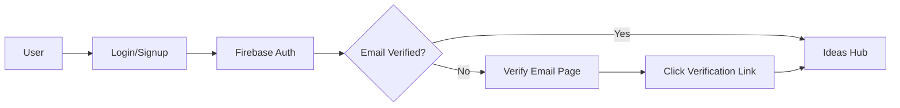

# TradeIdea - Architecture & Deployment Documentation

## 🏗️ System Architecture

### Frontend Architecture
- **Framework**: Next.js 15.5.4 with App Router
- **Language**: TypeScript
- **Styling**: Tailwind CSS v4 with custom dark mode
- **Build Tool**: Turbopack (Next.js bundler)
- **Deployment**: Vercel (Serverless)

### Backend & Database
- **Authentication**: Firebase Authentication
- **Database**: Firestore (NoSQL)
- **Storage**: Firebase Storage (for future file uploads)
- **Hosting**: Vercel Edge Network

### State Management
- **Context API**: React Context for global state
  - `AuthContext`: User authentication & profile
  - `TradingContext`: Trading ideas & portfolio
  - `SymbolsContext`: Stock symbols data
  - `ThemeContext`: Dark/light mode

## 📁 Project Structure

```
myportfolio-web/
├── app/                          # Next.js App Router pages
│   ├── ideas/                    # Trading ideas hub
│   │   ├── [id]/page.tsx        # Idea detail page
│   │   ├── new/page.tsx         # Create new idea
│   │   └── page.tsx             # Ideas list
│   ├── portfolio/page.tsx       # User portfolio
│   ├── profile/page.tsx         # User profile
│   ├── login/page.tsx           # Auth page
│   ├── layout.tsx               # Root layout
│   └── page.tsx                 # Landing page
├── components/                   # Reusable components
│   ├── Navigation.tsx           # Main navigation
│   └── icons.tsx                # SVG icon components
├── contexts/                     # React Context providers
│   ├── AuthContext.tsx          # Authentication
│   ├── TradingContext.tsx       # Trading logic
│   ├── SymbolsContext.tsx       # Symbols data
│   └── ThemeContext.tsx         # Theme management
├── lib/                         # Utilities & configs
│   └── firebase.ts              # Firebase config
└── public/                      # Static assets
```

## 🔐 Authentication Flow



## 💾 Data Models

### User Profile
```typescript
{
  uid: string
  email: string
  displayName?: string
  bio?: string
  tradingExperience?: 'beginner' | 'intermediate' | 'advanced' | 'expert'
  favoriteStrategies?: string
  createdAt: Timestamp
  updatedAt: Timestamp
}
```

### Trading Idea
```typescript
{
  id: string
  userId: string
  userName: string
  symbol: string                    // Stock symbol (e.g., RELIANCE)
  title: string
  analysis: string                  // Detailed analysis/rationale
  whenToEnter?: string             // Entry conditions
  whenToExit?: string              // Exit conditions
  visibility: 'public' | 'private'
  timeframe: 'short term' | 'long term'
  riskLevel: 'low' | 'medium' | 'high'
  entryPrice: number
  stopLoss: number
  target1: number
  target2?: number
  target3?: number
  analysisType: 'technical' | 'fundamental' | 'both'
  tags: string[]
  status: 'cooking' | 'active' | 'hit target' | 'hit sl' | 'cancelled'
  likes: number
  commentCount: number
  followers: string[]              // User IDs following this idea
  createdAt: Timestamp
  updatedAt: Timestamp
}
```

### Portfolio Position
```typescript
{
  id: string
  userId: string
  ideaId: string
  symbol: string
  tradeType: 'long' | 'short'
  entryPrice: number
  currentPrice: number
  target1: number
  stopLoss: number
  quantity: number
  totalValue: number
  pnl: number
  pnlPercent: number
  status: 'active' | 'closed'
  dateTaken: string
  dateClosed?: string
  createdAt: Timestamp
}
```

## 🚀 Deployment Architecture

### Vercel Deployment
```
GitHub Repository
      ↓
Vercel Build Pipeline
      ↓
Edge Network (Global CDN)
      ↓
User Browser
```

### Environment Variables
```bash
# Firebase Configuration
NEXT_PUBLIC_FIREBASE_API_KEY=***
NEXT_PUBLIC_FIREBASE_AUTH_DOMAIN=smartfarm-c04cc.firebaseapp.com
NEXT_PUBLIC_FIREBASE_PROJECT_ID=smartfarm-c04cc
NEXT_PUBLIC_FIREBASE_STORAGE_BUCKET=smartfarm-c04cc.firebasestorage.app
NEXT_PUBLIC_FIREBASE_MESSAGING_SENDER_ID=***
NEXT_PUBLIC_FIREBASE_APP_ID=***
NEXT_PUBLIC_FIREBASE_MEASUREMENT_ID=***
```

### Build Configuration
```typescript
// next.config.ts
{
  typescript: {
    ignoreBuildErrors: true  // Temporary for rapid deployment
  },
  eslint: {
    ignoreDuringBuilds: true
  }
}
```

## 🌐 Domain & DNS Configuration

### Production Domain
- **Primary**: tradeidea.co.in
- **Vercel Domain**: tradeidea.vercel.app

### DNS Setup
```
Type: A Record
Host: @
Value: 76.76.21.21 (Vercel IP)
TTL: Auto
```

### SSL/TLS
- Auto-provisioned by Vercel
- Free Let's Encrypt certificates
- Auto-renewal enabled

## 🔄 CI/CD Pipeline

### Automated Deployment
1. Push to `main` branch on GitHub
2. Vercel webhook triggers build
3. Build runs with Next.js + Turbopack
4. Edge deployment to global CDN
5. Auto-invalidate cache
6. Live in ~30 seconds

### Git Workflow
```bash
# Development
git checkout -b feature/new-feature
git commit -m "feat: description"
git push origin feature/new-feature

# Production
git checkout main
git merge feature/new-feature
git push origin main  # Auto-deploys to Vercel
```

## 🎨 Theme System

### Dark Mode Implementation
- CSS custom properties via Tailwind v4
- System preference detection
- LocalStorage persistence
- No flash on load (inline script)

```typescript
// Theme options
type Theme = 'light' | 'dark' | 'system'

// Applied via className
<html className={theme === 'dark' ? 'dark' : ''}>
```

## 📊 Performance Optimizations

### Build Optimizations
- **Turbopack**: 10x faster than Webpack
- **Code Splitting**: Automatic route-based splitting
- **Image Optimization**: Next.js Image component (future)
- **Font Optimization**: Geist Sans/Mono self-hosted

### Runtime Optimizations
- **Edge Functions**: Vercel serverless functions
- **Static Generation**: Pre-rendered landing page
- **Incremental Static Regeneration**: Dynamic content caching
- **Client-side Caching**: React Query (future enhancement)

## 🔒 Security Features

### Authentication Security
- Firebase Security Rules (Firestore)
- Email verification required
- HTTPS-only cookies
- XSS protection via React

### Firestore Security Rules
```javascript
rules_version = '2';
service cloud.firestore {
  match /databases/{database}/documents {
    // Users collection
    match /users/{userId} {
      allow read: if request.auth != null;
      allow write: if request.auth.uid == userId;
    }

    // Ideas collection
    match /ideas/{ideaId} {
      allow read: if request.auth != null;
      allow create: if request.auth != null;
      allow update, delete: if request.auth.uid == resource.data.userId;
    }

    // Portfolio collection
    match /portfolio/{positionId} {
      allow read, write: if request.auth.uid == resource.data.userId;
    }
  }
}
```

## 📈 Scalability

### Current Capacity
- **Vercel**: Unlimited bandwidth (Pro plan)
- **Firebase**: 1M reads/day, 100K writes/day (Spark plan)
- **Concurrent Users**: ~10,000 (estimated)

### Future Scaling
- Upgrade to Firebase Blaze plan (pay-as-you-go)
- Implement Redis caching layer
- Add CDN for static assets
- Database sharding for high-traffic symbols

## 🛠️ Tech Stack Summary

| Layer | Technology | Version |
|-------|-----------|---------|
| Framework | Next.js | 15.5.4 |
| Language | TypeScript | 5.x |
| Styling | Tailwind CSS | 4.0 |
| Database | Firestore | Latest |
| Auth | Firebase Auth | Latest |
| Hosting | Vercel | Latest |
| Runtime | Node.js | 20.x |

## 🤖 Batch Processing Architecture

### Overview
TradeIdea uses automated batch jobs to fetch EOD (End-of-Day) market data, calculate technical indicators, and update Firestore with the latest analysis. The system supports two data sources with automatic fallback.

### Batch Job Types

#### 1. EOD Technical Analysis (Daily)
**Primary Script**: `eod_batch.sh` (uses DuckDB + NSE)
**Backup Script**: `eod_batch_yahoo.sh` (uses Yahoo Finance)
**Frequency**: Daily at 6 PM (weekdays)
**Duration**: ~1-2 seconds per symbol (after initial load)

**What it does:**
- Fetches EOD price data for all symbols
- Calculates 20+ technical indicators
- Updates Firestore `symbols/{symbolId}/technical`
- Stores historical data in DuckDB for incremental updates

#### 2. Fundamentals Analysis (Weekly)
**Script**: `fundamentals_batch.sh`
**Frequency**: Weekly (Sundays recommended)
**Duration**: ~5-10 seconds per symbol

**What it does:**
- Fetches company fundamentals (market cap, P/E, etc.)
- Updates Firestore `symbols/{symbolId}/fundamentals`
- Skips symbols with market cap < 1000 Cr

### Data Pipeline Architecture

```mermaid
graph TB
    A[Cron Job Trigger] --> B{Data Source}
    B -->|Primary| C[NSE via jugaad-data]
    B -->|Fallback| D[Yahoo Finance API]
    C --> E[DuckDB Storage]
    D --> E
    E --> F[Technical Analysis Engine]
    F --> G[Indicator Calculations]
    G --> H[Firestore Update]
    H --> I[symbols/{id}/technical]
    I --> J[Frontend Real-time Access]
```

### Technical Indicators Calculated

| Category | Indicators |
|----------|-----------|
| **Moving Averages** | SMA20, SMA50, SMA100, SMA200, EMA9, EMA21, EMA50 |
| **Trend** | Supertrend (Daily), Weekly Supertrend, MACD, MACD Signal, MACD Histogram |
| **Momentum** | RSI14 |
| **Volatility** | Bollinger Bands (Upper, Middle, Lower) |
| **Volume** | Volume, 20-day Average Volume |
| **Period Changes** | Weekly, Monthly, Quarterly % changes |

### Batch Processing Scripts

```
myportfolio-web/
├── eod_batch.sh              # Main: DuckDB + NSE (PRODUCTION)
├── eod_batch_yahoo.sh        # Backup: Yahoo Finance
├── fundamentals_batch.sh     # Weekly fundamentals
├── scripts/
│   ├── analyze-symbols.py           # Yahoo Finance version
│   └── experimental/
│       ├── analyze-symbols-duckdb.py   # DuckDB + NSE version
│       └── fetch_nse_data.py           # NSE data fetcher
└── data/
    └── eod.duckdb           # Local DuckDB database (auto-created)
```

### Data Source Comparison

#### Primary: DuckDB + NSE
```bash
./eod_batch.sh
```

**Advantages:**
- ✅ Official NSE data (more accurate)
- ✅ Incremental updates (only fetches new data)
- ✅ 2-3x faster after initial load
- ✅ Offline capable (uses cached data)
- ✅ No rate limits

**Disadvantages:**
- ⚠️ Initial load takes 30-60s per symbol (fetches 2 years of data)
- ⚠️ Requires DuckDB and jugaad-data Python packages

#### Fallback: Yahoo Finance
```bash
./eod_batch_yahoo.sh
```

**Advantages:**
- ✅ Reliable and battle-tested
- ✅ No initial setup required
- ✅ Consistent 3-5s per symbol

**Disadvantages:**
- ⚠️ Rate limits (can throttle on high volume)
- ⚠️ Fetches full history every time
- ⚠️ Slightly slower than DuckDB incremental updates

### Cron Job Setup

#### Daily Technical Analysis (Recommended)
```bash
# Run weekdays at 6 PM (after market close)
0 18 * * 1-5 cd /path/to/myportfolio-web && ./eod_batch.sh >> logs/eod.log 2>&1
```

#### Weekly Fundamentals
```bash
# Run Sundays at 8 PM
0 20 * * 0 cd /path/to/myportfolio-web && ./fundamentals_batch.sh >> logs/fundamentals.log 2>&1
```

### Batch Job Workflow

1. **Symbol Discovery**
   - Fetch symbols from Firestore `symbols` collection
   - Include symbols from active portfolios and ideas
   - Deduplicate and prepare list

2. **Data Fetching (Per Symbol)**
   - Check DuckDB for existing data
   - Fetch only new data from NSE (incremental)
   - Store in DuckDB for future runs

3. **Technical Analysis**
   - Load 730 days of data (2 years for weekly calculations)
   - Calculate all technical indicators
   - Generate buy/sell/neutral signals

4. **Firestore Update**
   - Update `symbols/{symbolId}/technical` document
   - Merge with existing data (preserves fundamentals)
   - Set `lastFetched` timestamp

5. **Logging & Statistics**
   - Display success/failure counts
   - Show DuckDB statistics
   - Log errors for debugging

### Technical Indicator Details

#### Daily Supertrend
- **Period**: 10
- **Multiplier**: 3
- **Timeframe**: Daily candles
- **Use Case**: Entry signals, intraday/swing trading
- **Fields**: `supertrend`, `supertrendDirection`

#### Weekly Supertrend
- **Period**: 10
- **Multiplier**: 3
- **Timeframe**: Weekly candles (5-day aggregation)
- **Use Case**: Exit criteria, reduces whipsaws
- **Fields**: `weeklySupertrend`, `weeklySupertrendDirection`

#### Signal Scoring System
The batch job calculates an overall signal score:
- **STRONG_BUY**: Score ≥ 5
- **BUY**: Score ≥ 2
- **NEUTRAL**: -2 < Score < 2
- **SELL**: Score ≤ -2
- **STRONG_SELL**: Score ≤ -5

**Scoring Logic:**
- Price above SMA200: +2
- Price above EMA50: +1
- Supertrend bullish: +2
- RSI oversold (<30): +2
- Golden cross: +2
- MACD bullish: +1
- Volume spike: +1

### Performance Metrics

#### First Run (Initial Load)
| Metric | DuckDB + NSE | Yahoo Finance |
|--------|-------------|---------------|
| Time per symbol | ~30-60s | ~3-5s |
| Total for 100 symbols | ~50-100 min | ~5-8 min |

#### Subsequent Runs (Daily Updates)
| Metric | DuckDB + NSE | Yahoo Finance |
|--------|-------------|---------------|
| Time per symbol | **~1-2s** ⚡ | ~3-5s |
| Total for 100 symbols | **~2-3 min** | ~5-8 min |

### Error Handling

#### Automatic Recovery
- Symbol fetch timeout: 60 seconds
- Skips symbols with insufficient data (<200 days)
- Continues processing on individual failures
- Logs all errors for debugging

#### Manual Intervention
```bash
# Check batch job status
tail -f logs/eod.log

# Rerun for specific symbols (if needed)
source venv/bin/activate
python3 scripts/analyze-symbols.py

# Switch to fallback if DuckDB has issues
./eod_batch_yahoo.sh
```

### DuckDB Database Schema

```sql
-- Table: eod_data
CREATE TABLE eod_data (
  symbol VARCHAR,
  date DATE,
  open DOUBLE,
  high DOUBLE,
  low DOUBLE,
  close DOUBLE,
  volume BIGINT,
  PRIMARY KEY (symbol, date)
);
```

### Monitoring & Maintenance

#### Daily Checks
- Verify Firestore `lastFetched` timestamps
- Check log files for errors
- Monitor DuckDB database size

#### Weekly Tasks
- Review failed symbols
- Update symbols collection if new stocks listed
- Backup DuckDB database

#### Monthly Tasks
- Analyze batch job performance
- Optimize slow-running symbols
- Update Python dependencies

### Future Enhancements

#### Planned Features
- [ ] Real-time intraday data updates
- [ ] Multi-timeframe analysis (5min, 15min, 1hour)
- [ ] Options data integration
- [ ] Sector/index correlations
- [ ] Machine learning price predictions

#### Scalability Improvements
- [ ] Parallel processing (multiple symbols simultaneously)
- [ ] Redis caching layer
- [ ] Distributed batch processing
- [ ] Cloud-based DuckDB (S3-backed)

## 📞 Maintenance & Support

### Monitoring
- Vercel Analytics (built-in)
- Firebase Console for database metrics
- Error tracking via Vercel logs
- Batch job logs in `logs/` directory

### Backup Strategy
- Firestore automatic backups (daily)
- Git repository backup on GitHub
- Environment variables stored in Vercel
- DuckDB database backed up weekly

### Update Process
```bash
# Update dependencies
npm update

# Update Python packages
source venv/bin/activate
pip install --upgrade -r requirements.txt

# Check for breaking changes
npm outdated

# Deploy to production
git push origin main
```

---

**Last Updated**: January 2025
**Domain**: https://tradeidea.co.in
**Status**: ✅ Production Ready
